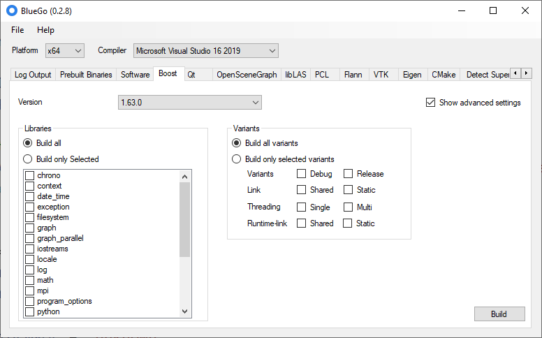

BlueGo
======

`BlueGo` is a tool which builds Boost, Qt and OpenSceneGraph libraries using Visual Studio 2010/12/13. You just have to start the application, select your configuration and hit the Build button- everything else works automatically. The application downloads the library, extracts it and builds it.

The following build configurations are available:

* Supported platforms: x86, x64
* Supported compilers: Microsoft Visual Studio 2010, Microsoft Visual Studio 2012 and Microsoft Visual Studio 2013
* Supported boost versions: 1.51.0, 1.52.0, 1.53.0, 1.54.0, 1.55.0, 1.56.0, 1.57.0, 1.58.0 and from Source (SVN)
* Supported Qt versions: 4.8.3, 4.8.4, 5.0.0, 5.0.1, 5.1.0, 5.1.1, 5.2.1, 5.3.0, 5.3.1
* Supported OpenSceneGraph versions: 3.0.1
* Supported Eigen versions: 3.2.0, 3.2.1
* Supported libLAS versions: 1.7.0
* Supported PCL versions: 1.7.1, From Source (GIT)

More info can be found at [http://bluego.vertexwahn.de](http://bluego.vertexwahn.de)

BlueGo is licensed under the **BSD 2-Clause License** (see License.txt for further information).

## Alternatives ##
1. You can also download prebuild versions of boost from: <a href="http://boost.teeks99.com/">http://boost.teeks99.com/</a>

2. CMake offers a features called ExternalProject (<a href="http://cmake.org/cmake/help/v2.8.10/cmake.html#module:ExternalProject">http://cmake.org/cmake/help/v2.8.10/cmake.html#module:ExternalProject</a>).
A simple demo can be found here: <a href="https://bitbucket.org/Vertexwahn/cmakedemos/src/ec4988812eee4661fa7ac64c9fe4a6f1a4decf13/ExternalProject/CMakeLists.txt?at=default">CMake External Project Demo</a>.
@image cmakeexternalproject.png
Package manager for CMake (based on ExternalProject) can be found here: <a href="https://github.com/ruslo/hunter/tree/master/examples">https://github.com/ruslo/hunter/tree/master/examples</a>

3. Using a batch file to build boost:
<a href="http://www.codeproject.com/Articles/11597/Building-Boost-libraries-for-Visual-Studio">Link</a>

4. Build it manually: <a href="https://bitbucket.org/Vertexwahn/bluego/src/b128e16bf5260b2eea1e5750fe51fdd46015f0df/How%20to%20build%20third%20party%20libraries%20with%20Visual%20Studio.docx?at=default">How to build third party libraries with Visual Studio.docx</a>

5. Use <a href="http://www.nuget.org/">NuGet</a>. Initially NuGet worked only for .Net Libraries but now it supports also native C++ libraries like the pnglib.

6. Get Qt from http://qt-project.org/

7. Use biicode: https://github.com/biicode/. Seems a very promising project that allows reusing, integrating and sharing various C++ libraries including boost.

8. vcpkg https://github.com/Microsoft/vcpkg/

9. mkvfx: https://github.com/meshula/mkvfx

10. hunter: https://github.com/ruslo/hunter

11. http://www.cpm.rocks/

12. Prebuild boost libraries https://sourceforge.net/projects/boost/files/boost-binaries/

13. **Use [Bazel](https://bazel.build/)**. There are rules for [Boost](https://github.com/nelhage/rules_boost), [Qt](https://github.com/Vertexwahn/rules_qt6) and almost everything else you will need. I switched completely to Bazel and will never look back ;).

## Videos ##

How to quickly install Boost, QT into Visual Studio 2012 and 2010 for C++ development:

Detection of superfluous include files:

## License ##

Copyright (c) 2012 - 2015, Julian Amann
All rights reserved.

Redistribution and use in source and binary forms, with or without modification, are permitted provided that the following conditions are met:

- Redistributions of source code must retain the above copyright notice, this list of conditions and the following disclaimer.
- Redistributions in binary form must reproduce the above copyright notice, this list of conditions and the following disclaimer in the documentation and/or other materials provided with the distribution.

THIS SOFTWARE IS PROVIDED BY THE COPYRIGHT HOLDERS AND CONTRIBUTORS "AS IS" AND ANY EXPRESS OR IMPLIED WARRANTIES, INCLUDING, BUT NOT LIMITED TO, THE IMPLIED WARRANTIES OF MERCHANTABILITY AND FITNESS FOR A PARTICULAR PURPOSE ARE DISCLAIMED. IN NO EVENT SHALL THE COPYRIGHT HOLDER OR CONTRIBUTORS BE LIABLE FOR ANY DIRECT, INDIRECT, INCIDENTAL, SPECIAL, EXEMPLARY, OR CONSEQUENTIAL DAMAGES (INCLUDING, BUT NOT LIMITED TO, PROCUREMENT OF SUBSTITUTE GOODS OR SERVICES; LOSS OF USE, DATA, OR PROFITS; OR BUSINESS INTERRUPTION) HOWEVER CAUSED AND ON ANY THEORY OF LIABILITY, WHETHER IN CONTRACT, STRICT LIABILITY, OR TORT (INCLUDING NEGLIGENCE OR OTHERWISE) ARISING IN ANY WAY OUT OF THE USE OF THIS SOFTWARE, EVEN IF ADVISED OF THE POSSIBILITY OF SUCH DAMAGE.
